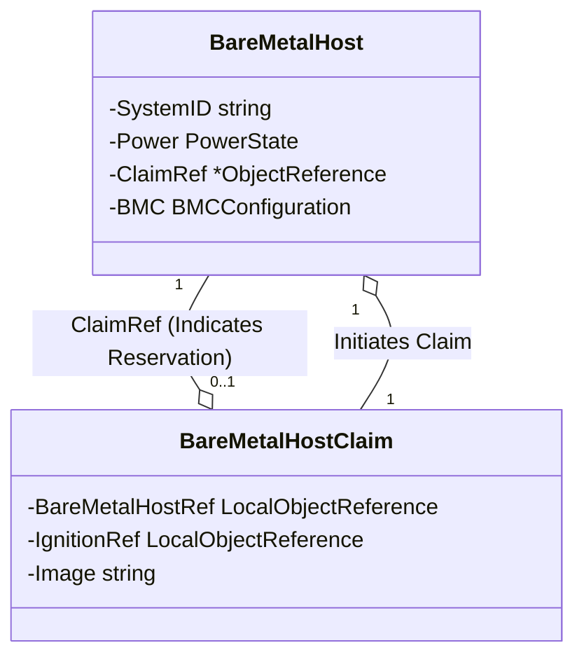

# BareMetalHost and BareMetalHostClaim Relationship

## Introduction

This document outlines the relationship between two Kubernetes resources: `BareMetalHost` and `BareMetalHostClaim`. The primary interaction is initiated by the `BareMetalHostClaim`, which triggers the reservation of a `BareMetalHost`. The `ClaimRef` in the `BareMetalHost` is used to indicate that the host has been successfully claimed.

## Resource Definitions

### BareMetalHost

Represents a physical server in the Kubernetes environment. Its specification includes details such as system identification, power state, and BMC (Baseboard Management Controller) configuration.

```go
type BareMetalHostSpec struct {
    SystemID string              `json:"systemId"`
    Power    PowerState          `json:"power"`
    ClaimRef *v1.ObjectReference `json:"claimRef,omitempty"`
    BMC      BMCConfiguration    `json:"bmc"`
}
```

### BareMetalHostClaim

Used by users or automated systems to claim a `BareMetalHost`. It includes a reference to a host, optional ignition configuration, and the image to be used.

```go
type BareMetalHostClaimSpec struct {
    BareMetalHostRef v1.LocalObjectReference `json:"bareMetalHostRef"`
    IgnitionRef      v1.LocalObjectReference `json:"ignitionRef,omitempty"`
    Image            string                  `json:"image"`
}
```

## Claim-Initiated Reservation Process

1. **Claim Creation**: A user or system creates a `BareMetalHostClaim`, specifying the desired `BareMetalHost` through `BareMetalHostRef`.

2. **Host Reservation**: Upon detecting a new claim, the controller managing these resources validates the claim and updates the corresponding `BareMetalHost`. The `ClaimRef` field in `BareMetalHostSpec` is set to reference the initiating claim, indicating the host is now reserved.

3. **Reservation Confirmation**: With the `ClaimRef` set, the `BareMetalHost` is marked as claimed, preventing other claims from reserving the same host.

4. **Resource Allocation**: The `BareMetalHost` is then prepared according to the claim's specifications, such as loading the specified image and applying ignition configurations if provided.

## Diagram for Claim-Initiated Reservation



## Conclusion

The relationship between `BareMetalHost` and `BareMetalHostClaim` is primarily driven by the claim process, where the `BareMetalHostClaim` initiates the reservation of a `BareMetalHost`. The `ClaimRef` in the `BareMetalHost` serves as an acknowledgment of this reservation, ensuring that each host can only be claimed by one entity at a time. This mechanism allows for efficient and clear management of physical hardware resources in a Kubernetes-based environment.
