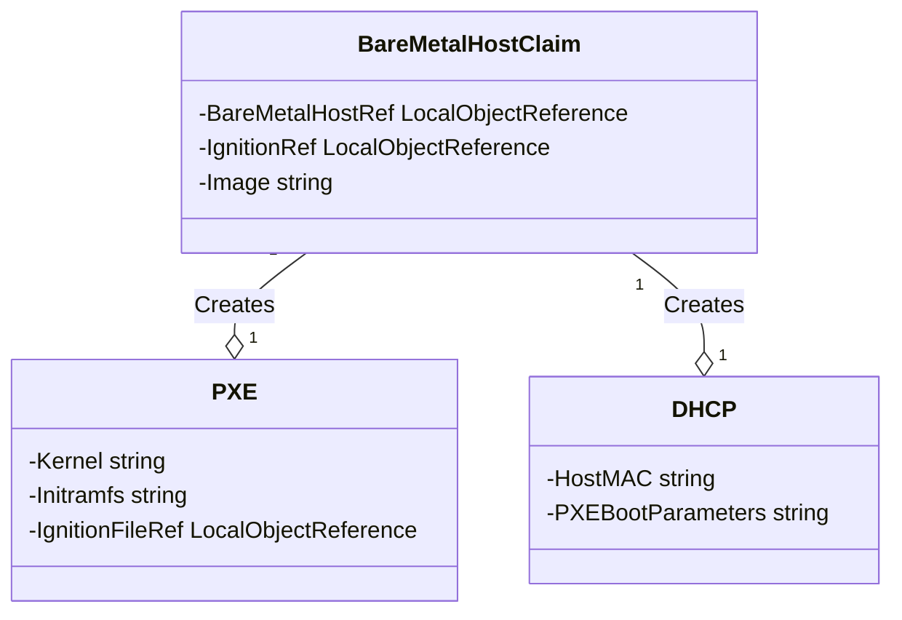

# Bootstrapping BareMetalHosts with PXE and DHCP

## Introduction

This concept outlines the procedure to bootstrap `BareMetalHosts` using two custom Kubernetes resources: `PXE` and `DHCP`. These resources are dynamically created from a `BareMetalHostClaim`, facilitating automated provisioning and configuration of physical hardware in a Kubernetes environment.

## Resource Definitions

### BareMetalHostClaim

A request to claim a `BareMetalHost`, specifying desired configurations and the target host.

### PXE

Defines the boot parameters for a host, including kernel, initramfs, and a custom Ignition configuration.

### DHCP

Configures a DHCP server to provide specific PXE boot instructions to a `BareMetalHost` based on its MAC address.

## Process Overview

1. **Claim Processing**: Upon creation of a `BareMetalHostClaim`, a controller processes the claim to determine the required bootstrapping configurations.

2. **DHCP Creation**: A `DHCP` resource is created, specifying the PXE boot parameters and the MAC address of the target `BareMetalHost`.

3. **PXE Creation**: An `PXE` is also created, detailing the OS-specific boot parameters and a reference to the custom Ignition file.

4. **Resource Linking**: The `BareMetalHostClaim` is updated to reference the newly created `PXE` and `DHCP`, ensuring coordinated provisioning.

## Sample Resource Manifests

### PXE Manifest

```yaml
apiVersion: metal.example.com/v1
kind: PXE
metadata:
  name: ipxeconfig-sample
spec:
  bareMetalHostRef:
    name: sample-host
  image: foo:latest
  ignitionRef:
    name: custom-ignition-config
```

### DHCP Manifest

```yaml
apiVersion: network.example.com/v1
kind: DHCP
metadata:
  name: dhcpconfig-sample
spec:
  bareMetalHostRef:
    name: sample-host
  hostMAC: "00:1A:4B:16:01:FE"
  pxeBootParameters: "http://example.com/pxeboot/pxeconfig"
```

## Diagram for Resource Relationships



## Conclusion

The integration of `PXE` and `DHCP` with `BareMetalHostClaim` streamlines the provisioning process of `BareMetalHosts` in a Kubernetes environment. By automating the configuration of PXE boot parameters and OS-specific settings, this system allows for efficient and precise deployment of physical hardware resources. The sample manifests provide a foundation for implementing these resources in real-world scenarios.
