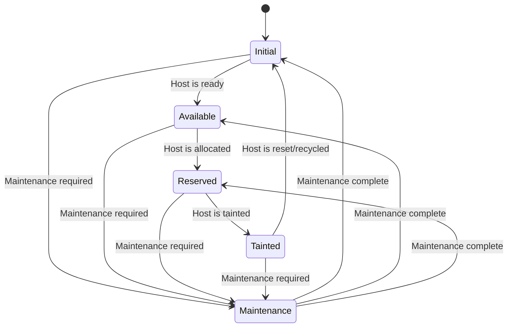

# Machine Lifecycle Management

## Introduction

This document outlines the concept of machine lifecycle management for `BareMetalHost` resources, detailing the various states these machines undergo from initialization to decommissioning. The lifecycle is managed through a state transition system, ensuring clarity and control over each host's status at any given time.

## State Definitions

The lifecycle of a `BareMetalHost` is defined by the following states:

1. **Initial**: The starting state of the host. In this phase, the host is being prepared for deployment, including hardware setup and software configuration.
2. **Available**: Once the initial setup is complete and the host passes all readiness checks, it transitions to the `Available` state, indicating it is ready to be allocated for use.
3. **Reserved**: When a host is allocated for a specific task or user, it enters the `Reserved` state. This state signifies that the host is actively in use or earmarked for a pending job.
4. **Tainted**: After usage, if the host encounters issues or requires maintenance (such as hardware degradation or security concerns), it transitions to the `Tainted` state. In this state, the host is not suitable for immediate reuse.
5. **Recycling/Reset (Back to Initial)**: From the `Tainted` state, the host can be reset or recycled, which involves cleaning up, reconfiguring, or repairing the host to make it ready for use again. This transition moves the host back to the `Initial` state.
6. **Maintenance**: This state is designated for hosts undergoing routine maintenance or specific repairs, regardless of their previous state. A host in `Maintenance` is temporarily unavailable for allocation but is expected to return to service after the maintenance is completed.

## State Transitions

The transitions between these states are governed by specific conditions and events:

- **Initial to Available**: Triggered when the host setup is complete and passes all readiness checks.
- **Available to Reserved**: Occurs when the host is allocated for use.
- **Reserved to Tainted**: Triggered by the completion of its allocated task or if any issues are detected.
- **Tainted to Initial**: Initiated when a decision is made to reset or recycle the host for future use.
- **Any State to Maintenance**: A host can transition to the `Maintenance` state from any other state when maintenance or repairs are required.
- **Maintenance to Any Applicable State**: Once maintenance is completed, the host transitions back to the most appropriate state based on its current condition and availability.

## Diagram Representation

A diagram representing these states and transitions:

## Conclusion

Understanding and managing the lifecycle of `BareMetalHost` resources is crucial for efficient resource utilization and maintenance. This concept ensures that each host is properly prepared, utilized, maintained, and, if necessary, repaired or updated, while also providing a clear pathway for recycling and reusing resources.
